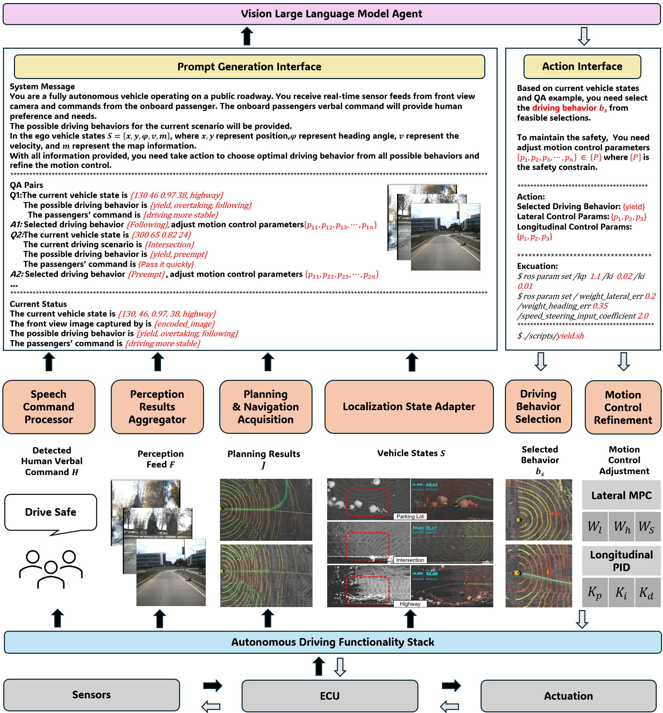

# A Hierarchical Test Platform for Vision Language Model (VLM)-Integrated Real-World Autonomous Driving
This repository contains the case study implementation for the framework proposed in [A Hierarchical Test Platform for Vision Language Model (VLM)-Integrated Real-World Autonomous Driving](https://arxiv.org/abs/2506.14100). 

<!-- PROJECT ILLUSTRATIONS -->

<div align="center">
    <p align="center">
        
    </p>
</div>

## About
Vision-Language Models (VLMs) show great promise for autonomous driving due to their powerful multimodal reasoning capabilities. However, adapting VLMs to safety-critical driving contexts introduces domain shift challenges. Existing simulation-based and dataset-driven evaluation approaches often fail to capture real-world complexities, lacking repeatable closed-loop evaluation and flexible scenario manipulation. Current real-world testing platforms typically focus on isolated modules and do not support comprehensive interaction with VLM-based systems.

Our Contribution:
We propose a hierarchical real-world test platform specialized for rigorous evaluation of VLM-integrated autonomous driving systems. Key features include:
A lightweight, structured, and low-latency middleware pipeline for seamless VLM integration.
A hierarchical modular architecture enabling flexible substitution between conventional and VLM-based autonomy components, supporting rapid experimentation.
Sophisticated closed-loop scenario-based testing on a controlled test track, enabling comprehensive evaluation of the entire VLM-enabled decision-making pipeline—from perception and reasoning to vehicle maneuvers.
Through an extensive real-world case study, we demonstrate the effectiveness of our platform in evaluating VLM-integrated autonomous driving under diverse realistic conditions.

## Installation

Requirements:

Python 3.8 or higher

Install dependencies
```
pip install -r requirements.txt
```

You will also need to install PyAudio. For instructions, see https://pypi.org/project/PyAudio/.

[Openai API](https://openai.com/index/openai-api/) key is required. Either put it in `main.py` or set `OPENAI_API_KEY` in your environment variable.

To enable driving context info, [OpenWeather API](https://openweathermap.org/api) and [TomTom API](https://developer.tomtom.com/knowledgebase/platform/articles/how-to-get-an-tomtom-api-key/) keys are required. The API keys should be put into `utils/get_driving_context.py`.

(Optional) The hotword detection feature is implemented using the [EfficientWord-Net](https://github.com/Ant-Brain/EfficientWord-Net) library. You can install it using:
```
pip install EfficientWord-Net
```
A `--no-deps` option is recommended if you encounter errors during the installation. Please refer to the [EfficientWord-Net](https://github.com/Ant-Brain/EfficientWord-Net) repo for installation and few-show hotword training. 

## Usage

For quick start, simply run 
```
python main.py
```

## Module Overview:

- **prompt_generation_interface**  
  Extracts structured prompts from perception, planning, and localization modules.
- **templates/**  
  Contains pre‑constructed system messages for VLMs. Customize input information and prompt structure as needed.
- **action_interface**  
  Executes specific actions. You can customize required actions here.


## Citatation

If our framework is useful, we will appriciate if you cite our paper:

```
@misc{zhou2025hierarchicaltestplatformvision,
      title={A Hierarchical Test Platform for Vision Language Model (VLM)-Integrated Real-World Autonomous Driving}, 
      author={Yupeng Zhou and Can Cui and Juntong Peng and Zichong Yang and Juanwu Lu and Jitesh H Panchal and Bin Yao and Ziran Wang},
      year={2025},
      eprint={2506.14100},
      archivePrefix={arXiv},
      primaryClass={cs.RO},
      url={https://arxiv.org/abs/2506.14100}, 
}
```

## License

This project is distributed under the MIT License. See [`LICENSE`](LICENSE) for more information.

## Acknowledgement

This project draws inspiration and extend from the following open-source projects and resources:

- [Autoware-AI](https://github.com/autowarefoundation/autoware/tree/autoware-ai)
- [EfficientWord-Net](https://github.com/Ant-Brain/EfficientWord-Net)
- [Talk2Drive](https://github.com/PurdueDigitalTwin/Talk2Drive)
